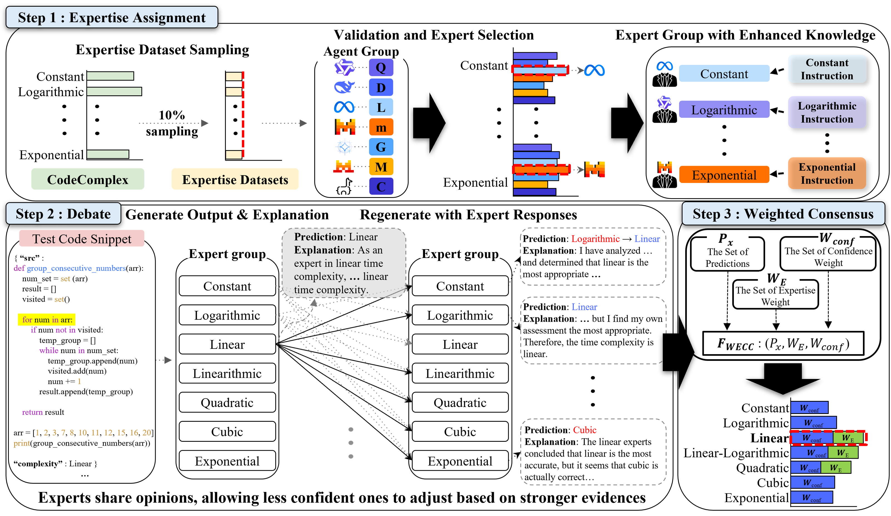

# $MEC^3O$: Multi-Expert Consensus for Code Time Complexity Prediction

<p align="center">
  <a href="https://github.com/suhanmen/MECO/stargazers">
    
  </a>
  <a href="https://github.com/suhanmen/MECO/commits/main">
    
  </a>
  <a href="https://github.com/suhanmen/MECO/graphs/contributors">
    
  </a>
</p>

<div align="center">
    <a href="https://arxiv.org/abs/2510.09049"><b>Paper Link</b>📖</a>
</div><br>




## 📰 News
- 📢 NEW! **$MEC^3O$: Multi-Expert Consensus for Code Time Complexity Prediction** is now on arXiv. (Oct 10, 2025)
- 📢 NEW! The official **$MEC^3O$** framework has been released on GitHub. (Oct 14, 2025)


## 🔍 Motivation
Rule-based heuristics and template-style analysis often fail to generalize: tiny structural/semantic changes (loop bounds, recursion bases, divide-and-conquer splits) can flip the true class (e.g., $O(n)$ ↔ $O(n\log n)$ ↔ $O(n^2)$). We therefore turn to **LLMs** to perform contextual, multi-step reasoning beyond brittle, hand-crafted rules.

However, **single-model** LLM methods—zero/few-shot, **CoT**, **self-consistency**, etc.—often suffer **Degeneration-of-Thought (DoT)**: an early hypothesis gets reinforced and counter-evidence is ignored.

**Multi-Agent Debate (MAD)** can alleviate Degeneration-of-Thought (DoT), but naive majority voting or a separate **judge** can still suppress **minority-correct** arguments and add overhead.

Therefore, we propose $MEC^3O$, which addresses these MAD limitations by preserving minority-correct signals without a judge.


## ✨ About $MEC^3O$
**$MEC^3O$** (**M**ulti-**E**xpert **C**onsensus for **C**ode **C**omplexity Prediction) is a novel approach for predicting the **time complexity of source code**. Unlike traditional **single-LLM** approaches or **multi-agent debate (MAD)** frameworks, $MEC^3O$ strategically assigns **expert roles** to LLMs based on their **demonstrated proficiency** in different complexity classes and integrates their opinions through a **weighted consensus mechanism**.


## 🚀 What makes $MEC^3O$ valuable?
✅ **Introduces class-aware expertization** – $MEC^3O$ identifies each model’s per-class strengths (e.g., $O(n\log n)$, $O(n^2)$), assigns class-specialized expert LLMs with tailored instructions, and runs focused debates—outperforming naive MAD on CodeComplex (≥10% gains in accuracy and macro-F1).

✅ **Solves MAD’s judge/majority pitfalls** – A weighted expertise–confidence consensus (with logit-based confidence scores) replaces majority voting and external judges, preserving minority-correct signals and mitigating DoT without extra overhead.

✅ **Scalable, plug-and-play consensus** – Want broader time-complexity coverage? **Increase the number of experts** by adding class-specialized roles. $MEC^3O$ scales in either direction without a judge or pipeline changes, while keeping predictions robust and class-balanced.


## 📈 Results
Our comprehensive evaluation of $MEC^3O$ on CodeComplex (Java & Python) yields three key findings:

* **Multi-expert beats single & naive MAD** – On **CodeComplex** (Java & Python), $MEC^3O$ outperforms single-model baselines (zero/few-shot, CoT, self-consistency, Reflexion) and naive MAD variants (majority/judge): **Average gains over the best open-source baseline** are **+3.37 pp in Accuracy** and **+5.39 pp in macro-F1**. Per split, improvements reach **up to +4.49 pp Acc. (Java)** and **+8.37 pp F1 (Java)**, while also **remaining competitive with closed models** (e.g., close to GPT-4o-mini in Acc., and near GPT-4o / GPT-o4-mini in macro-F1).

* **Weighted consensus fixes MAD’s pitfalls** – Replacing majority voting/judge with a **weighted expertise–confidence consensus** (using **logit-based confidence**) yields **+3.92% accuracy** and **+8.71% macro-F1** over majority voting on average, while **preserving minority-correct signals** and mitigating DoT.

* **Class-wise robustness** – $MEC^3O$ reduces common confusions (e.g., **$O(\log n)$** vs. **$O(n\log n)$**) and maintains **more balanced performance across complexity classes**, with most remaining errors confined to adjacent polynomial orders (e.g., **$O(n^2)$** vs. **$O(n^3)$**).

For detailed quantitative results and ablations, please refer to our paper.

## 🛠️ Setup
The datasets used in this research are available in the `data/full` directory:
* `Python.jsonl` — A benchmark split of **4,900 Python programs** from **CodeComplex**, annotated by experts into **seven complexity classes** {$O(1)$, $O(\log n)$, $O(n)$, $O(n\log n)$, $O(n^2)$, $O(n^3)$, $O(2^n)$}. Per-class balanced across the seven classes (uniform counts per class).

* `Java.jsonl` — A benchmark split of **4,900 Java programs** from **CodeComplex**, annotated into the **same seven classes** with the **same per-class balance** as above.

## ⚡ Quickstart
The following scripts guide you through running $MEC^3O$ step by step:

## **Step 1: Clone the Repository**
~~~shell
git clone https://github.com/suhanmen/MECO.git
cd MECO
~~~

### **Step 2: Set up the enviroment**
~~~shell
conda env create --file setting/envirometn.yaml
conda activate meco
~~~

### **Step 3: Single LLM Inference**
~~~shell
sh ./scripts/main.sh Single <your_gpu_devices>
~~~
Runs single-LLM inference to evaluate model performance across all complexity classes.
This step identifies potential candidates for expert assignment.

### **Step 4: Find Expertise**
~~~shell
sh ./scripts/main.sh Find_expertise <your_gpu_devices>
~~~
Analyzes results from Step 3 to assign each LLM an expert role for its strongest complexity class.
Each expert receives class-specialized instructions optimized for reasoning within its domain.

### **Step 5: Multi-Expert Debate**
~~~shell
sh ./scripts/main.sh MECO <your_gpu_devices>
~~~
Launches the multi-expert debate phase, where class-specific experts exchange, refine, and justify their predictions.
Finally, $MEC^3O$ integrates their outputs using a weighted consensus mechanism to produce the final complexity classification.

## Citation
```bibtex
@misc{HahnLH25,
      title={MEC$^3$O: Multi-Expert Consensus for Code Time Complexity Prediction}, 
      author={Joonghyuk Hahn and Soohan Lim and Yo-Sub Han},
      year={2025},
      eprint={2510.09049},
      archivePrefix={arXiv},
      primaryClass={cs.AI},
      url={https://arxiv.org/abs/2510.09049}, 
}
```